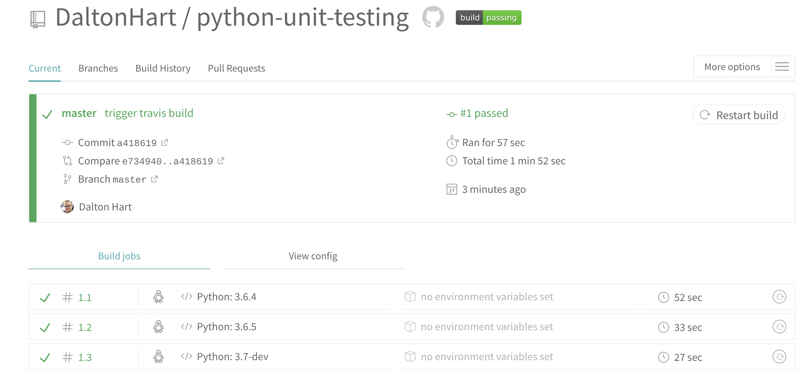

#  Python Unit Testing

[](https://travis-ci.org/DaltonHart/python-unit-testing)


## Unit tests
Tests can be broadly split into two categories: **Unit Tests** and **Integration Tests**. Both are important.

In **Unit Tests**, which we'll talk about today, we try to isolate each component (or class/function) and test it on its own. We separate our Controllers from our Views and test the boundary of its interface.
**Unit tests** tend to run faster because we're testing small components. By isolatign components from each other to test them we're forced to write better object-oriented code. The functionality can't blur across several modules without us having to do a lot of work in the test to stub that out.


## Integration Tests
In **Integration Tests** we combine components together, sometimes just a few and other times the entire system. In Django, integration tests often drive the server and test the entirety of the system--the full request response cycle. These tests tend to take much longer to run. They test the cohesion of components and that the interface between them is behaving as we expect.

Both types of tests are important. There are also other types but they can generally be broken down into finer grained versions of the above. Together the Unit and Integration tests you write become part of your test suite.


## How are tests used in industry?

Many companies require that all the code they develop comes with tests. Often before code can be depoloyed, or merged into master, the entire test suite is run and all tests must pass.


## Continuous Integration 

We will be using a *continuous integration service* called [**Travis CI**](https://travis-ci.org/) to ensure the code we push to github passes our tests.  This will ensure that our code passes all of the tests we assign it as we continue to develop. We can tell Travis to run the tests when we create pull requests or whenever we push code to a specific branch.  

### Prerequisites
To start using **Travis CI**, make sure you have:

- A GitHub account.
- Owner permissions for a project hosted on GitHub.


### To get started with **Travis CI**
1. Go to Travis-ci.com and Sign up with GitHub.
2. Accept the Authorization of **Travis CI**. You’ll be redirected to GitHub.
3. Click the green Activate button, and select the repositories you want to use with **Travis CI**.
4. Add a `.travis.yml` file to your repository to tell **Travis CI** what to do. The following example specifies a Python project that should be built with Python 3.7-dev.


```yml
language: python
python:
 - "3.6.4"
 - "3.6.5"
 - "3.7-dev
 ```


5. Add the `.travis.yml` file to git, commit and push, to trigger a **Travis CI** build:
> Travis only runs builds on the commits you push after you’ve added a `.travis.yml` file.

6. Check the build status page to see if your build passes or fails, according to the return status of the build command by visiting **Travis CI** .com build status and selecting your repository.


Here is an example screenshot of a successful build report on **Travis CI**:



## Unit Testing with Python

We will be using a standard package included with Python called `unittest`. Lets write a couple simple mathematical functions and write code to test the output.

1.  In the `functions` folder, open the `math_functions.py` file.  This file has two 'stubbed out' functions -- you can see they have been defined and simply return their sole parameter. These functions exist but don't yet have full functionality.

2. In the `tests` folder, open the `test_math_functions.py` file. This file will house our testing code. We will write a class that will house functions that test our math functions.  

3. In our test file will now need to include the `unittest` testing package.

```python
# in test/test_math_function.py
import unittest
```

> We will be storing our tests and our code in separate folders for modularity.  To import a file or files from a separate folder, we will need to use the `from <folder> import <file>` statement.

4. Also include the `math_functions.py` file we will be testing. Add this right below our `unittest` import:

``` python
# in test/test_math_function.py
from functions import math_functions
````

To make a folder available for import, we need to set up an extra line for our Python to access nearby folders. Execuite this command in your terminal:

```bash
export PYTHONPATH=$HOME/dirWithScripts/:$PYTHONPATH;
```

5. Now we need to create a testing  `Class` to store all of our individual tests:

```python
# in test/test_math_function.py
class KnowledgeBase(unittest.TestCase):
```

6. Now we will write a function with a specialized `unittest` method called an *assertion* to compare an expected value with a resulting value from running our math functions.

```python
    # in test/test_math_function.py
    # in the KnowledgeBase Class definition
    def test_area_of_circle_sanity(self):
        """ area_of_circle(1) """
        # Captue the results of the function
        result = math_functions.area_of_circle(1)
        # Check for exptected output
        expected = 1
        self.assertEqual(expected, result)
```

  This method creates two variables: `expected` and `result`.  The last line will use the `unittest`-inherited class `KnowledgeBase` to call the `.assertEqual()` method.  This method will evaluate whether `exepected` and `result` will be of the same value and type.  If there is an equivalency, then this individual testing function will pass. Otherwise it will fail.

Here are some other TestCase methods available to use:


| Method   	                  | Checks that           | 
|-----------------------------|-----------------------|
| `assertEqual(a, b)`	        | a == b	              |
| `assertNotEqual(a, b)`      |	a != b	              |
| `assertTrue(x)`             |	bool(x) is True	      |
| `assertFalse(x) `           |	bool(x) is False	    | 
| `assertIs(a, b)`	          | a is b                |
| `assertIsNot(a, b)`         |	a is not b            |
| `assertIsNone(x)`           |	x is None             |
| `assertIsNotNone(x)`        |	x is not None         |
| `assertIn(a, b) `           |	a in b                |
| `assertNotIn(a, b) `        |	a not in b            |
| `assertIsInstance(a, b)`	  | isinstance(a, b)      |
| `assertNotIsInstance(a, b)` |	not isinstance(a, b)  |


7. At the end of your test file, we will includ a small line of code that will trigger the test Class when the file is run:

```python
# in test/test_math_function.py
# at the bottom of the file
if __name__ == '__main__':
    unittest.main()
```

8. The resulting test file should look similar to this:

```python
""" unit tests for math_functions """

import unittest
from functions import math_functions

class KnowledgeBase(unittest.TestCase):
    """ unit test class for math_funcitons) """
    def test_area_of_circle_sanity(self):
        """ area_of_circle(1) """
        # Captue the results of the function
        result = math_functions.area_of_circle(1)
        # Check for exptected output
        expected = 1
        self.assertEqual(expected, result)

if __name__ == '__main__':
    unittest.main()

```


9. Now run the test file to see our first fail or pass!

```bash
python3 tests/test_math_functions
```
